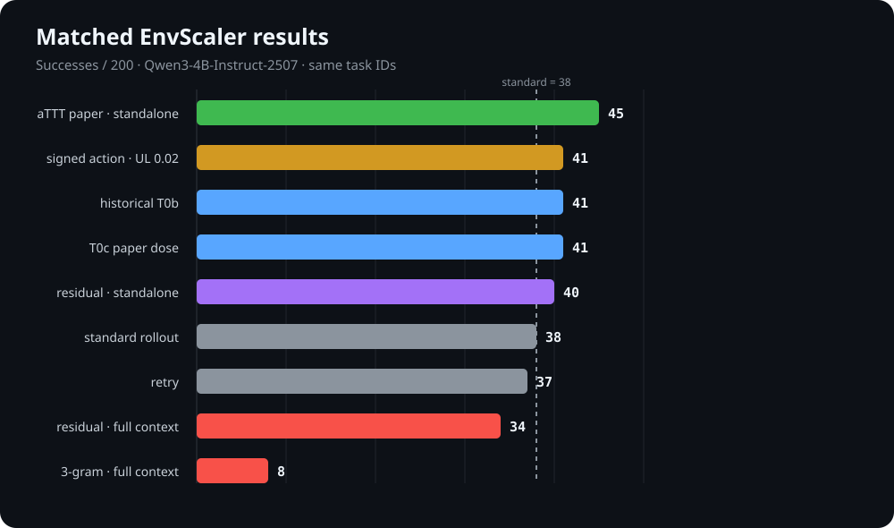
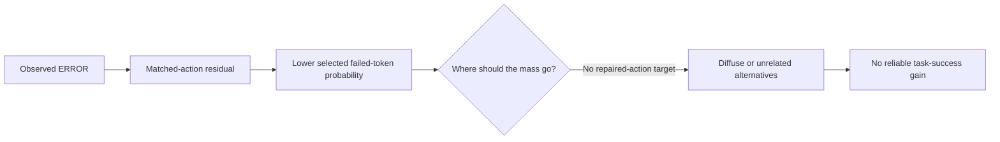

# sediment — residual-gated streaming test-time training for agents

Experiences flow through; only what passes the gate settles into the weights.

An agent serves a task stream (predict-then-update, G=1 per task). After each
task, a hindsight pass prices the experience via residuals (per-token deltas
from scoring the trajectory with vs. without an evidence block built from
retrieved past experiences + the task's own outcome + self-reflection). The
priced residual is distilled into a persistent session LoRA. Goal: the agent
gets stronger the more it is used — without group rollouts, without offline RL.

## Main method (as of 2026-08-25, `p3m800_refl_*_f` arms)

The main contribution is **residual-priced posterior distillation**; the
gate is an insurance layer, not the story. The current arm is:

| Piece | Setting | Why (forensics that fixed it) |
| --- | --- | --- |
| Evidence block `E` | top-4 retrieved trajectories (verbatim actions + truncated results + their reflections) + own outcome (`SUCCEEDED/FAILED`, numeric `reward=`, final feedback) + own reflection (`reflect=true`) | 08-23: outcome-only block falsified (−3.5pp); steps block flips the ceiling positive |
| Residual | `δ_t = log π(t|x,E) − log π(t|x)`, two prefills, per token | resid P0/P1 |
| Channels | `train_channels=act`: **observation tokens carry no weight** | 08-25 three independent forensics: obs-only variants sink probes 0.167/0.167/0.333 — the model memorises instance data (patient ids, log ids) |
| Pricing | `signed=true`: every action token, no step-status gate; dead band `pos_thr=0.05` / `neg_thr=0.6`; `+min(δ,1.55)` CE, `−min(−δ,4.51)` unlikelihood `λ=0.1` (`p3m800_refl_signed_f`). Sibling arm: relu(δ) + `gate_error_actions` (`p3m800_refl_act_f`) | reward direction is not a hard mask; continuous rewards need no change here |
| Token masks | framing tokens (`<tool_call>`, roles, `<\|im_end\|>`) never carry credit; negative credit only on values / content / tool name, never on JSON keys (`sediment/semantic.py`) | 08-25: no-floor signed arm collapsed into narrating without tool calls — negative credit had landed on the call framing |
| Dose ∝ evidence | `w_norm_floor=3`: loss `= Σw·CE / max(Σw, floor)`, per sign | 08-25: weighted-mean loss let samples with 0.6–1.7 units of mass drive full-strength steps (act-only loss 4→0.001 in 4 steps) |
| Merge | EMA `merge_alpha=0.5`, W=16, staleness 1 window, lr 1.5e-4, α32, 2 epochs, ≤2 candidate samples/window | P1.7 knee |
| Gate | G2/G3 measured (6 probes) but **not enforced** in the main arms (`gate_min_behavior_change=0`, `gate_min_probe_delta=-999`); kept as insurance for long streams | 08-25: gated arm blocks collapse but generates no gain; 12-probe noise ±0.3 ≈ signal size |

The only remaining binary assumption is the `SUCCEEDED/FAILED` tag in the
block (`SUCCESS_THRESHOLD=0.999`, `experience.py`) and the retry trigger; the
numeric reward is already rendered, so graded-reward benchmarks (CL-Bench) only
need that tag re-expressed as a relative position (e.g. vs. buffer history).

Status: `p3m800_refl_act_f` / `p3m800_refl_signed_f` running on the 800-task
EnvScaler stream (frozen 800 / icl_refl controls). Verdict rule: whether the
w6–11 "hit 30 steps, never settle" count stays flat and success vs. frozen.
See `docs/EXPERIMENTS.md` §P3 for the full 08-25 forensics chain.

Docs (Chinese): `docs/BACKGROUND.md` (positioning & claims),
`docs/EXPERIMENTS.md` (P1–P4), `docs/SYSTEM.md` (4-GPU design),
`docs/LITERATURE.md` (survey notes). Module APIs: `CONTRACTS.md`.

## Stable memory signal pilot (2026-08-28): not supported

The preregistered family-held-out 10-train / 12-test pilot completed all 22
proposal windows and six arms, but failed its efficacy gate. Cluster-equal mean
gain was 0.0102 for `stable`, versus 0.0241 for the discovery-selected single,
0.0296 for the donor mean, and 0.0140 for shuffled memory. The stable model's
write rate was zero: all 24 stable/shuffled synthesized adapters were
parameter-identical no-ops, so their nonzero paired gains measure replay noise,
not a learned update effect. Do not scale this version.

See the [`full report`](loops/stable-signal-latest/report.md) and
[`aggregate-only evidence`](loops/stable-signal-latest/evidence/aggregate_public.json).
No raw trajectories, task-level pairs, adapters, checkpoints, or worker logs
are included in the repository-facing bundle.

The next experiment is train-feasibility-first: require confirmation-positive
targets in multiple fitting clusters and at least one validation cluster, add
an empirical reference-vs-reference replay control, then freeze a fresh
family-held-out test and the complete imported runtime closure.

## Quickstart (mock, no GPU)

```bash
python3 -m venv .venv && .venv/bin/pip install -r requirements.txt
.venv/bin/python -m pytest tests/ -q
.venv/bin/python scripts/run_stream.py --engine mock --tasks 8 --window 4
```

GPU path (vLLM serving + peft trainer) is lazy-imported; see `docs/SYSTEM.md`.

## Historical snapshot: within-episode arms (2026-08-24, superseded)

These are the tier0 within-episode arms (episode-local LoRA, no stream
accumulation). Superseded by the streaming main method above; kept for
forensics.

All numbers below are paired on the same 200 EnvScaler `rl` tasks with
`Qwen/Qwen3-4B-Instruct-2507`.  Adaptation arms use an episode-local LoRA; the
paper-dose arms use rank 8, alpha 16, learning rate `5e-4`, and two optimizer
steps per accepted update.  Aggregate reports, frozen configs, and analysis
scripts are checked in under
[`loops/four-gpu-t0b-latest/`](loops/four-gpu-t0b-latest/).
Raw trajectories and worker logs remain local and are excluded from Git.



| Arm | Success | Mean reward | Readout |
| --- | ---: | ---: | --- |
| aTTT paper, latest observation standalone | **45/200** | **0.6351** | Best tested arm |
| Signed action, ERROR UL `lambda=0.02` | 41/200 | 0.6084 | Mechanically works; behavioral null |
| Historical T0b | 41/200 | 0.6236 | Tied on success, higher reward than signed |
| T0c paper dose | 41/200 | 0.5974 | Tied on success, lower reward than signed |
| Residual, latest observation standalone | 40/200 | 0.6311 | No residual-weight main-effect win |
| Residual x 3-gram, standalone | 40/200 | 0.6287 | Active 3-gram factor; null addition |
| Standard rollout | 38/200 | 0.6078 | Frozen baseline |
| Retry | 37/200 | 0.6202 | Retry baseline |
| Residual, full trajectory context | 34/200 | 0.5619 | Context interference |
| 3-gram, full trajectory context | 8/200 | 0.4262 | Severe context interference |

### What the factorial says

| Token weighting | Standalone target | Full-trajectory target |
| --- | ---: | ---: |
| aTTT 3-gram | **45/200**, reward 0.635 | 8/200, reward 0.426 |
| residual | 40/200, reward 0.631 | 34/200, reward 0.562 |

The dominant factor is training context, not residual weighting.  Full-context
observation training teaches an action-conditioned environment predictor and
then reuses that adapter for action generation.  It costs 37 successes under
3-gram weighting (`p=7.84e-10`, exact paired McNemar).  Residual weighting is
protective only inside that already harmful regime; in the healthy standalone
regime it scores 40 versus aTTT's 45 (`p=0.180`).

### Why signed unlikelihood did not improve behavior



The optimization itself did not fail.  The signed arm completed 200 unique
tasks with zero top-level errors: 399/417 selected windows produced accepted
updates, 95 material negative-branch updates lowered ERROR weighted log-prob
by `0.04925` on average, and 167 positive-branch updates raised ok weighted
log-prob by `0.01282`.  No accepted update violated its requested direction.

The failure is at the objective-to-behavior interface:

1. Unlikelihood specifies **away from the failed action**, not **toward a
   repaired action**.  Released probability mass can move to many irrelevant
   alternatives.
2. The matched-action likelihood contrast is a weak credit locator.  `93.67%`
   of token deltas have magnitude below `1e-4`; its AUC for ranking ok above
   ERROR is `0.420`, and the remaining signal is dominated by a few structured
   tool/identifier outliers rather than demonstrated causal blame.
3. The selected failed fragments need not recur in a useful future state
   within the same episode.  Suppression can therefore be locally correct but
   behaviorally inert.
4. The observed lift over standard rollout is only +3 paired tasks
   (rescues/harms `6/3`, `p=0.508`) and the arm is -4 paired tasks behind aTTT
   (`2/6`, `p=0.289`).  This run provides no evidence of a positive effect;
   an exact `lambda=0` matched control is still required to isolate the causal
   contribution of the negative branch.

The next informative objective is a paired failed-action versus
hindsight-repaired-action target.  If the cheaper causal ablation is preferred
first, run the exact `lambda=0` control with the masks, KL limit, backtracking,
and task IDs frozen.  Full analysis and integrity evidence are in the
[`experiment report`](loops/four-gpu-t0b-latest/report.md).

## Layout

```
sediment/types.py       shared dataclasses (contract; do not fork per-module)
sediment/config.py      StreamConfig
sediment/engine/        Engine protocol, MockEngine, vLLM client (multi-LoRA, scoring)
sediment/envs/          Env protocol, ToyOrderEnv, EnvScaler adapter
sediment/rollout/       single-rollout agent loop (G=1)
sediment/buffer.py      experience buffer + retrieval (the "group" is the stream's history)
sediment/experience.py  evidence block builder (retrieved + own outcome)
sediment/hindsight.py   2-prefill scoring -> per-token deltas -> w_t
sediment/spans.py       chat-template role/token span alignment
sediment/gate.py        magnitude/recurrence + behavioral replay + transfer probe
sediment/trainer.py     w_t-weighted distillation into LoRA (torch lazy; stub for tests)
sediment/registry.py    versioned adapter registry (runtime hot-load friendly)
sediment/merge.py       candidate -> session merge (EMA)
sediment/scheduler.py   windowed predict-then-update pipeline (staleness = 1 window)
sediment/router.py      sticky episode routing over engine pool
sediment/eval.py        W-AUC, gain, snapshot runner, report writers
scripts/run_stream.py   streaming experiment CLI
scripts/run_p1_probe.py per-task internalization probe (P1)
```

Ported/adapted from `../resid` (P0 probe) and `../resid/resid_verl`
(hindsight + credit_belief loss, de-verl'd).
